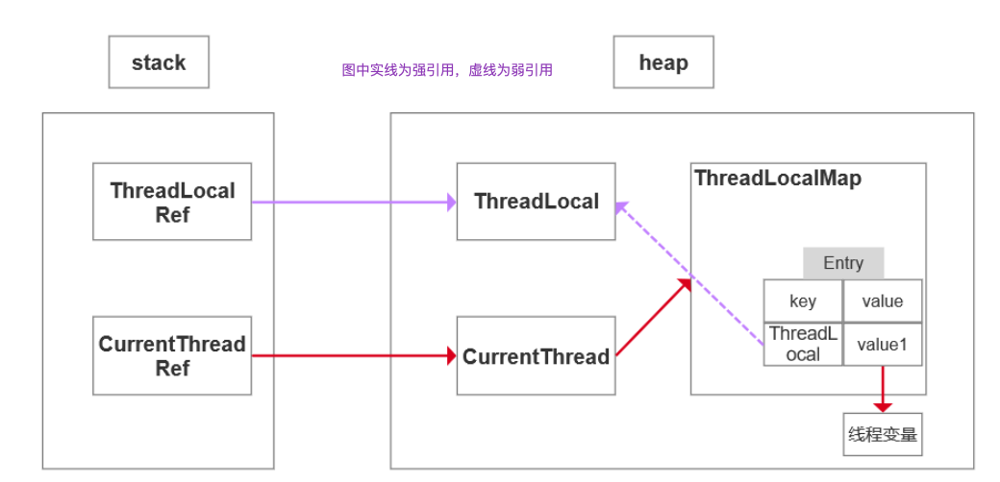

# Java基础

## 面向对象

什么是面向对象?

- 对比面向过程，是两种不同的处理问题的角度
- 面向过程更注重事情的每一个步骤及顺序，面向对象更注重事情有哪些参与者(对象)、及各自需要做什么


比如:洗衣机洗衣服 

面向过程会将任务拆解成一系列的步骤(函数)，1、打开洗衣机----->2、放衣服----->3、放洗衣粉--->4、清洗----->5、烘干 

面向对象会拆出人和洗衣机两个对象: 

- 人:打开洗衣机 放衣服 放洗衣粉 
- 洗衣机:清洗 烘干

从以上例子能看出，面向过程比较直接高效，而面向对象更易于复用、扩展和维护


面向对象

**封装**:封装的意义，在于明确标识出允许外部使用的所有成员函数和数据项

内部细节对外部调用透明，外部调用无需修改或者关心内部实现

1. javabean的属性私有，提供getset对外访问，因为属性的赋值或者获取逻辑只能由javabean本身决 定。而不能由外部胡乱修改

   ```java
   private String name;
   public void setName(String name){
       this.name = "tuling_"+name;
   }
   // 该name有自己的命名规则，明显不能由外部直接赋值
   ```

2. orm框架 操作数据库，我们不需要关心链接是如何建立的、sql是如何执行的，只需要引入mybatis，调方法即可

**继承**:继承基类的方法，并做出自己的改变和/或扩展。子类共性的方法或者属性直接使用父类的，而不需要自己再定义，只需扩展自己个性化的

**多态**:基于对象所属类的不同，外部对同一个方法的调用，实际执行的逻辑不同。 


继承，方法重写，父类引用指向子类对象

```java
父类类型 变量名 = new 子类对象 ; 
变量名.方法名(); // 调用的是子类的方法
```

无法调用子类特有的功能，即调用的方法必须在父类中也存在


## **JDK JRE JVM**


- JDK: Java Develpment Kit java 开发工具
- JRE: Java Runtime Environment java运行时环境
- JVM: java Virtual Machine java 虚拟机


## =和equals比较

-  ==对比的是栈中的值，基本数据类型是变量值，引用类型是堆中内存对象的地址
- equals:object中默认也是采用==比较，通常会重写
- 不做特殊处理的话==和equals差别不大

Object

```java
public boolean equals(Object obj) {
    return (this == obj);
}
```

String

```java
public boolean equals(Object anObject) {
    if (this == anObject) {
        return true;
    }
    if (anObject instanceof String) {
        String anotherString = (String)anObject;
        int n = value.length;
        if (n == anotherString.value.length) {
            char v1[] = value;
            char v2[] = anotherString.value;
            int i = 0;
            while (n-- != 0) {
                if (v1[i] != v2[i])
                    return false;
								i++; 
            }
            return true;
        }
}
    return false;
}
```

上述代码可以看出，String类中被复写的equals()方法其实是比较两个字符串的内容。

```java
public class StringDemo {
      public static void main(String args[]) {
            String str1 = "Hello";
            String str2 = new String("Hello");
            String str3 = str2; // 引用传递 
            System.out.println(str1 == str2); // false 
            System.out.println(str1 == str3); // false 
            System.out.println(str2 == str3); // true
        		System.out.println(str1.equals(str2)); // true
        		System.out.println(str1.equals(str3)); // true
        		System.out.println(str2.equals(str3)); // true
        } 
}
```


## hashCode与equals

hashCode介绍:

hashCode() 的作用是获取哈希码，也称为散列码;它实际上是返回一个int整数。这个哈希码的作用是 确定该对象在哈希表中的索引位置。hashCode() 定义在JDK的Object.java中，Java中的任何类都包含有 hashCode() 函数。 散列表存储的是键值对(key-value)，它的特点是:能根据“键”快速的检索出对应的“值”。这其中就利用 到了散列码!(可以快速找到所需要的对象)


为什么要有hashCode:

以**“HashSet如何检查重复”**为例子来说明为什么要有hashCode

对象加入HashSet时，HashSet会先计算对象的hashcode值来判断对象加入的位置，看该位置是否有 值，如果没有、HashSet会假设对象没有重复出现。但是如果发现有值，这时会调用equals()方法来 检查两个对象是否真的相同。如果两者相同，HashSet就不会让其加入操作成功。如果不同的话，就会 重新散列到其他位置。这样就大大减少了equals的次数，相应就大大提高了执行速度。

- 如果两个对象相等，则hashcode一定也是相同的 
- 两个对象相等,对两个对象分别调用equals方法都返回true 
- 两个对象有相同的hashcode值，它们也不一定是相等的 
- 因此，equals方法被覆盖过，则hashCode方法也必须被覆盖 
- hashCode()的默认行为是对堆上的对象产生独特值。如果没有重写hashCode()，则该class的两个 对象无论如何都不会相等(即使这两个对象指向相同的数据)


## **final**

最终的

-  修饰类:表示类不可被继承
-  修饰方法:表示方法不可被子类覆盖，但是可以重载
-  修饰变量:表示变量一旦被赋值就不可以更改它的值。

1. 修饰成员变量

   - 如果final修饰的是类变量，只能在静态初始化块中指定初始值或者声明该类变量时指定初始值。
   - 如果final修饰的是成员变量，可以在非静态初始化块、声明该变量或者构造器中执行初始值。 

2. 修饰局部变量

   系统不会为局部变量进行初始化，局部变量必须由程序员显示初始化。因此使用final修饰局部变量时， 即可以在定义时指定默认值(后面的代码不能对变量再赋值)，也可以不指定默认值，而在后面的代码 中对final变量赋初值(仅一次)

   ```java
   public class FinalVar {
   	final static int a = 0;//再声明的时候就需要赋值 或者静态代码块赋值 
     /**
   	static{
   	a = 0; }
   	*/
   	final int b = 0;//再声明的时候就需要赋值 或者代码块中赋值 或者构造器赋值
     /*{
     b = 0;
     }*/
     public static void main(String[] args) {
       final int localA; //局部变量只声明没有初始化，不会报错,与final无关。 
       localA = 0;//在使用之前一定要赋值
       //localA = 1; 但是不允许第二次赋值
     } 
   }
   ```

3. 修饰基本类型数据和引用类型数据

   - 如果是基本数据类型的变量，则其数值一旦在初始化之后便不能更改

   - 如果是引用类型的变量，则在对其初始化之后便不能再让其指向另一个对象。**但是引用的值是可变 的**。

     ```java
     public class FinalReferenceTest{
         public static void main(){
     			final int[] iArr={1,2,3,4}; 
           iArr[2]=-3;//合法 iArr=null;//非法，对iArr不能重新赋值
     			final Person p = new Person(25); 
           p.setAge(24);//合法
     			p=null;//非法
         }
     }
     ```

4. **为什么局部内部类和匿名内部类只能访问局部final变量?**

   编译之后会生成两个class文件，Test.class Test1.class

   ```java
   public class Test {
     public static void main(String[] args) {
     }
     //局部final变量a,b
     public void test(final int b) {//jdk8在这里做了优化, 不用写,语法糖，但实际上也是有
     的，也不能修改
       final int a = 10; //匿名内部类
       new Thread(){
           public void run() {
               System.out.println(a);
               System.out.println(b);
           };
       }.start();
     }
   }
   class OutClass {
        private int age = 12;
        public void outPrint(final int x) {
            class InClass {
                 public void InPrint() {
                     System.out.println(x);
     								System.out.println(age);
                 } 
            }
     			new InClass().InPrint();
        }
   }
   ```

   首先需要知道的一点是: 内部类和外部类是处于同一个级别的，内部类不会因为定义在方法中就会随着 方法的执行完毕就被销毁。

   这里就会产生问题:当外部类的方法结束时，局部变量就会被销毁了，但是内部类对象可能还存在(只有 没有人再引用它时，才会死亡)。这里就出现了一个矛盾:内部类对象访问了一个不存在的变量。为了解 决这个问题，就将局部变量复制了一份作为内部类的成员变量，这样当局部变量死亡后，内部类仍可以 访问它，实际访问的是局部变量的"copy"。这样就好像延长了局部变量的生命周期

   将局部变量复制为内部类的成员变量时，必须保证这两个变量是一样的，也就是如果我们在内部类中修改了成员变量，方法中的局部变量也得跟着改变，怎么解决问题呢?

   就将局部变量设置为final，对它初始化后，我就不让你再去修改这个变量，就保证了内部类的成员变量 和方法的局部变量的一致性。这实际上也是一种妥协。使得局部变量与内部类内建立的拷贝保持一致。


## String、StringBuffer、StringBuilder

1. String是final修饰的，不可变，每次操作都会产生新的String对象 
2. StringBuffer和StringBuilder都是在原对象上操作 
3. StringBuffer是线程安全的，StringBuilder线程不安全的（多线程环境下使用共享变量，要保证结果的正确性的情况下。若要额外加锁，就是线程不安全的，否则就是安全的。StringBuffer的方法都是synchronized修饰的，不需要额外加锁，因此是线程安全的。）
4. StringBuffer方法都是synchronized修饰的
5. 性能:StringBuilder > StringBuffer > String 


场景:经常需要改变字符串内容时使用后面两个

优先使用StringBuilder，多线程使用共享变量时使用StringBuffer


## **重载和重写的区别**

**重载:** 发生在同一个类中，方法名必须相同，参数类型不同、个数不同、顺序不同，方法返回值和访问 修饰符可以不同，发生在编译时。

**重写:** 发生在父子类中，方法名、参数列表必须相同，返回值范围小于等于父类，抛出的异常范围小于 等于父类，访问修饰符范围大于等于父类;如果父类方法访问修饰符为private则子类就不能重写该方 法。

```java
public int add(int a,String b) 
public String add(int a,String b) //编译报错
```


## **接口和抽象类的区别**

抽象类可以存在普通成员函数，而接口中只能存在public abstract 方法。 抽象类中的成员变量可以是各种类型的，而接口中的成员变量只能是public static final类型的。 抽象类只能继承一个，接口可以实现多个。

接口的设计目的，是对类的行为进行约束(更准确的说是一种“有”约束，因为接口不能规定类不可以有 什么行为)，也就是提供一种机制，可以强制要求不同的类具有相同的行为。它只约束了行为的有无， 但不对如何实现行为进行限制。

而抽象类的设计目的，是代码复用。当不同的类具有某些相同的行为(记为行为集合A)，且其中一部分行 为的实现方式一致时(A的非真子集，记为B)，可以让这些类都派生于一个抽象类。在这个抽象类中实 现了B，避免让所有的子类来实现B，这就达到了代码复用的目的。而A减B的部分，留给各个子类自己 实现。正是因为A-B在这里没有实现，所以抽象类不允许实例化出来(否则当调用到A-B时，无法执 行)。

抽象类是对类本质的抽象，表达的是 is a 的关系，比如: BMW is a Car 。抽象类包含并实现子类的通 用特性，将子类存在差异化的特性进行抽象，交由子类去实现。

而接口是对行为的抽象，表达的是 like a 的关系。比如: Bird like a Aircraft (像飞行器一样可以 飞)，但其本质上 is a Bird 。接口的核心是定义行为，即实现类可以做什么，至于实现类主体是谁、 是如何实现的，接口并不关心。

使用场景:当你关注一个事物的本质的时候，用抽象类;当你关注一个操作的时候，用接口。

抽象类的功能要远超过接口，但是，定义抽象类的代价高。因为高级语言来说(从实际设计上来说也是)每个类只能继承一个类。在这个类中，你必须继承或编写出其所有子类的所有共性。虽然接口在功能上会弱化许多，但是它只是针对一个动作的描述。而且你可以在一个类中同时实现多个接口。在设计
阶段会降低难度


## **List和Set的区别**

- List:有序，按对象进入的顺序保存对象，可重复，允许多个Null元素对象，可以使用Iterator取出 所有元素，在逐一遍历，还可以使用get(int index)获取指定下标的元素 
- Set:无序，不可重复，最多允许有一个Null元素对象，取元素时只能用Iterator接口取得所有元 素，在逐一遍历各个元素


## ArrayList和LinkedLis区别

ArrayList:基于动态数组，连续内存存储，适合下标访问(随机访问)，扩容机制:因为数组长度固 定，超出长度存数据时需要新建数组，然后将老数组的数据拷贝到新数组，如果不是尾部插入数据还会 涉及到元素的移动(往后复制一份，插入新元素)，使用尾插法并指定初始容量可以极大提升性能、甚 至超过linkedList(需要创建大量的node对象)

LinkedList:基于链表，可以存储在分散的内存中，适合做数据插入及删除操作，不适合查询:需要逐 一遍历

遍历LinkedList必须使用iterator不能使用for循环，因为每次for循环体内通过get(i)取得某一元素时都需 要对list重新进行遍历，性能消耗极大。 另外不要试图使用indexOf等返回元素索引，并利用其进行遍历，使用indexlOf对list进行了遍历，当结 果为空时会遍历整个列表。


## HashMap和HashTable有什么区别?其底层实现是什 么?

区别 :

1. HashMap方法没有synchronized修饰，线程非安全，HashTable线程安全; 
2. HashMap允许key和value为null，而HashTable不允许


底层实现：数组+链表实现 

jdk8开始链表高度到8、数组长度超过64，链表转变为红黑树，元素以内部类Node节点存在

- 计算key的hash值，二次hash然后对数组长度取模，对应到数组下标， 
- 如果没有产生hash冲突(下标位置没有元素)，则直接创建Node存入数组，
-  如果产生hash冲突，先进行equal比较，相同则取代该元素，不同，则判断链表高度插入链表，链 表高度达到8，并且数组长度到64则转变为红黑树，长度低于6则将红黑树转回链表 
- key为null，存在下标0的位置
- 相同则取代该元素：key值相同，将value取代

数组扩容


## ConcurrentHashMap原理，jdk7和jdk8版本的区别

 **jdk7:**

数据结构:ReentrantLock+Segment+HashEntry，一个Segment中包含一个HashEntry数组，每个 HashEntry又是一个链表结构

元素查询:二次hash，第一次Hash定位到Segment，第二次Hash定位到元素所在的链表的头部 

锁:Segment分段锁 Segment继承了ReentrantLock，锁定操作的Segment，其他的Segment不受影响，并发度为segment个数，可以通过构造函数指定，数组扩容不会影响其他的segment（ConcurrentHashMap计算出key在哪一个段中，然后只锁定这一个段，其他段不受影响，因此是分段锁。锁的粒度更小。segment有多少个，就代表可以同时有多少个线程并发操作。）

get方法无需加锁，volatile保证

**jdk8:**

数据结构:synchronized+CAS+Node+红黑树，Node的val和next都用volatile修饰，保证可见性

查找，替换，赋值操作都使用CAS

锁:锁链表的head节点，不影响其他元素的读写，锁粒度更细，效率更高，扩容时，阻塞所有的读写 操作、并发扩容

读操作无锁: 

- Node的val和next使用volatile修饰，读写线程对该变量互相可见 
- 数组用volatile修饰，保证扩容时被读线程感知


## 什么是字节码?采用字节码的好处是什么?

 **java中的编译器和解释器:**

Java中引入了虚拟机的概念，即在机器和编译程序之间加入了一层抽象的虚拟的机器。这台虚拟的机器 在任何平台上都提供给编译程序一个的共同的接口。 

编译程序只需要面向虚拟机，生成虚拟机能够理解的代码，然后由解释器来将虚拟机代码转换为特定系 统的机器码执行。在Java中，这种供虚拟机理解的代码叫做 字节码(即扩展名为 .class的文件)，它不 面向任何特定的处理器，只面向虚拟机。

每一种平台的解释器是不同的，但是实现的虚拟机是相同的。Java源程序经过编译器编译后变成字节 码，字节码由虚拟机解释执行，虚拟机将每一条要执行的字节码送给解释器，解释器将其翻译成特定机 器上的机器码，然后在特定的机器上运行。这也就是解释了Java的编译与解释并存的特点。 Java源代码---->编译器---->jvm可执行的Java字节码(即虚拟指令)---->jvm---->jvm中解释器----->机器可执 行的二进制机器码---->程序运行。

**采用字节码的好处:**

Java语言通过字节码的方式，在一定程度上解决了传统解释型语言执行效率低的问题，同时又保留了解 释型语言可移植的特点。所以Java程序运行时比较高效，而且，由于字节码并不专对一种特定的机器， 因此，Java程序无须重新编译便可在多种不同的计算机上运行。


## Java中的异常体系

Java中的所有异常都来自顶级父类Throwable。

Throwable下有两个子类Exception和Error。 

Error是程序无法处理的错误，一旦出现这个错误，则程序将被迫停止运行。

Exception不会导致程序停止，又分为两个部分RunTimeException运行时异常和CheckedException检 查异常。 

RunTimeException常常发生在程序运行过程中，会导致程序当前线程执行失败。CheckedException常 常发生在程序编译过程中，会导致程序编译不通过。


## **Java类加载器**

JDK自带有三个类加载器:bootstrap ClassLoader、ExtClassLoader、AppClassLoader。 

BootStrapClassLoader是ExtClassLoader的父类加载器，默认负责加载%JAVA_HOME%lib下的jar包和 class文件。 

ExtClassLoader是AppClassLoader的父类加载器，负责加载%JAVA_HOME%/lib/ext文件夹下的jar包和 class类。 

AppClassLoader是自定义类加载器的父类，负责加载classpath下的类文件（程序猿编写的代码、引入的jar包等）。系统类加载器，线程上下 文加载器

继承ClassLoader实现自定义类加载器


## **双亲委托模型**


双亲委派模型的好处:

主要是为了安全性，避免用户自己编写的类动态替换 Java的一些核心类，比如 String。 同时也避免了类的重复加载，因为 JVM中区分不同类，不仅仅是根据类名，相同的 class文件被不 同的 ClassLoader加载就是不同的两个类


## GC如何判断对象可以被回收

- 引用计数法:每个对象有一个引用计数属性，新增一个引用时计数加1，引用释放时计数减1，计 数为0时可以回收，
- 可达性分析法:从 GC Roots 开始向下搜索，搜索所走过的路径称为引用链。当一个对象到 GC Roots 没有任何引用链相连时，则证明此对象是不可用的，那么虚拟机就判断是可回收对象。

> 引用计数法，可能会出现A 引用了 B，B 又引用了 A，这时候就算他们都不再使用了，但因为相互 引用 计数器=1 永远无法被回收。

GC Roots的对象有:

- 虚拟机栈(栈帧中的本地变量表)中引用的对象 
- 方法区中类静态属性引用的对象 
- 方法区中常量引用的对象 
- 本地方法栈中JNI(即一般说的Native方法)引用的对象

可达性算法中的不可达对象并不是立即死亡的，对象拥有一次自我拯救的机会。对象被系统宣告死亡至 少要经历两次标记过程:第一次是经过可达性分析发现没有与GC Roots相连接的引用链，第二次是在由 虚拟机自动建立的Finalizer队列中判断是否需要执行finalize()方法。

当对象变成(GC Roots)不可达时，GC会判断该对象是否覆盖了finalize方法，若未覆盖，则直接将其回 收。否则，若对象未执行过finalize方法，将其放入F-Queue队列，由一低优先级线程执行该队列中对象 的finalize方法。执行finalize方法完毕后，GC会再次判断该对象是否可达，若不可达，则进行回收，否 则，对象“复活”

每个对象只能触发一次finalize()方法 

由于finalize()方法运行代价高昂，不确定性大，无法保证各个对象的调用顺序，不推荐大家使用，建议遗忘它。


# 线程、并发

## 线程的生命周期?线程有几种状态

1. 线程通常有五种状态，创建，就绪，运行、阻塞和死亡状态。
2. 阻塞的情况又分为三种:
   1. 等待阻塞:运行的线程执行wait方法，该线程会释放占用的所有资源，JVM会把该线程放入“等待 池”中。进入这个状态后，是不能自动唤醒的，必须依靠其他线程调用notify或notifyAll方法才能被唤 醒，wait是object类的方法
   2. 同步阻塞:运行的线程在获取对象的同步锁时，若该同步锁被别的线程占用，则JVM会把该线程放 入“锁池”中。
   3. 其他阻塞:运行的线程执行sleep或join方法，或者发出了I/O请求时，JVM会把该线程置为阻塞状 态。当sleep状态超时、join等待线程终止或者超时、或者I/O处理完毕时，线程重新转入就绪状态。 sleep是Thread类的方法


1. 新建状态(New):新创建了一个线程对象。
2. 就绪状态(Runnable):线程对象创建后，其他线程调用了该对象的start方法。该状态的线程位于可运行线程池中，变得可运行，等待获取CPU的使用权。
3. 运行状态(Running):就绪状态的线程获取了CPU，执行程序代码。
4. 阻塞状态(Blocked):阻塞状态是线程因为某种原因放弃CPU使用权，暂时停止运行。直到线程进 入就绪状态，才有机会转到运行状态。
5. 死亡状态(Dead):线程执行完了或者因异常退出了run方法，该线程结束生命周期。


## sleep()、wait()、join()、yield()的区别

1. 锁池（方法前加了sychonized的就是加了锁，这时线程就会去竞争锁，若线程没有拿到锁，就会放在锁池中）

   所有需要竞争同步锁的线程都会放在锁池当中，比如当前对象的锁已经被其中一个线程得到，则其他线 程需要在这个锁池进行等待，当前面的线程释放同步锁后锁池中的线程去竞争同步锁，当某个线程得到 后会进入就绪队列进行等待cpu资源分配。

2. 等待池

   当我们调用wait()方法后，线程会放到等待池当中，等待池的线程是不会去竞争同步锁。只有调用了 notify()或notifyAll()后等待池的线程才会开始去竞争锁，notify()是随机从等待池选出一个线程放 到锁池，而notifyAll()是将等待池的所有线程放到锁池当中


1. sleep 是 Thread 类的静态本地方法，wait 则是 Object 类的本地方法。 

2. sleep方法不会释放lock，但是wait会释放，而且会加入到等待队列中。

   ```
   sleep就是把cpu的执行资格和执行权释放出去，不再运行此线程，当定时时间结束再取回cpu资源，参与cpu 的调度，获取到cpu资源后就可以继续运行了。而如果sleep时该线程有锁，那么sleep不会释放这个锁，而 是把锁带着进入了冻结状态，也就是说其他需要这个锁的线程根本不可能获取到这个锁。也就是说无法执行程 序。如果在睡眠期间其他线程调用了这个线程的interrupt方法，那么这个线程也会抛出 interruptexception异常返回，这点和wait是一样的。
   ```

3. sleep方法不依赖于同步器synchronized，但是wait需要依赖synchronized关键字。
4. sleep不需要被唤醒(休眠之后推出阻塞)，但是wait需要(不指定时间需要被别人中断)。
5. sleep 一般用于当前线程休眠，或者轮循暂停操作，wait 则多用于多线程之间的通信。
6. sleep 会让出 CPU 执行时间且强制上下文切换，而 wait 则不一定，wait 后可能还是有机会重新竞 争到锁继续执行的。


yield()执行后线程直接进入就绪状态，马上释放了cpu的执行权，但是依然保留了cpu的执行资格， 所以有可能cpu下次进行线程调度还会让这个线程获取到执行权继续执行

join()执行后线程进入阻塞状态，例如在线程B中调用线程A的join()，那线程B会进入到阻塞队 列，直到线程A结束或中断线程

```java
public static void main(String[] args) throws InterruptedException {
    Thread t1 = new Thread(new Runnable() {
@Override
        public void run() {
            try {
                Thread.sleep(3000);
            } catch (InterruptedException e) {
              e.printStackTrace();
            }
            System.out.println("22222222");
        }
    });
    t1.start();
    t1.join();
    // 这行代码必须要等t1全部执行完毕，才会执行 System.out.println("1111");
}
22222222
1111
```


## **对线程安全的理解**

不是线程安全、应该是内存安全，堆是共享内存，可以被所有线程访问

```
当多个线程访问一个对象时，如果不用进行额外的同步控制或其他的协调操作，调用这个对象的行为都可以获
得正确的结果，我们就说这个对象是线程安全的
```

**堆**是进程和线程共有的空间，分全局堆和局部堆。全局堆就是所有没有分配的空间，局部堆就是用户分 配的空间。堆在操作系统对进程初始化的时候分配，运行过程中也可以向系统要额外的堆，但是用完了 要还给操作系统，要不然就是内存泄漏。

> 在Java中，堆是Java虚拟机所管理的内存中最大的一块，是所有线程共享的一块内存区域，在虚 拟机启动时创建。堆所存在的内存区域的唯一目的就是存放对象实例，几乎所有的对象实例以及 数组都在这里分配内存。

**栈**是每个线程独有的，保存其运行状态和局部自动变量的。栈在线程开始的时候初始化，每个线程的栈 互相独立，因此，栈是线程安全的。操作系统在切换线程的时候会自动切换栈。栈空间不需要在高级语 言里面显式的分配和释放。

目前主流操作系统都是多任务的，即多个进程同时运行。为了保证安全，每个进程只能访问分配给自己的内存空间，而不能访问别的进程的，这是由操作系统保障的。

在每个进程的内存空间中都会有一块特殊的公共区域，通常称为堆(内存)。进程内的所有线程都可以访问到该区域，这就是造成问题的潜在原因。


## Thread、Runable的区别

Thread是类，单继承。Runnable是接口，多实现。Thread在Runnable的基础上做了扩展，提供更多功能。

Thread和Runnable的实质是继承关系，没有可比性。无论使用Runnable还是Thread，都会new Thread，然后执行run方法。用法上，如果有复杂的线程操作需求，那就选择继承Thread，如果只是简 单的执行一个任务，那就实现runnable。

```java
//会卖出多一倍的票 
public class Test {
    public static void main(String[] args) {
        // TODO Auto-generated method stub
        new MyThread().start();
        new MyThread().start();
}
     static class MyThread extends Thread{
        private int ticket = 5;
        public void run(){
            while(true){
                System.out.println("Thread ticket = " + ticket--);
                if(ticket < 0){
                  break;
                } 
            }
        }
     }
}
```

```java
//正常卖出
public class Test2 {
    public static void main(String[] args) {
        // TODO Auto-generated method stub
        MyThread2 mt=new MyThread2();
        new Thread(mt).start();
        new Thread(mt).start();
    }
    static class MyThread2 implements Runnable{
        private int ticket = 5;
        public void run(){
            while(true){
                System.out.println("Runnable ticket = " + ticket--);
                if(ticket < 0){
                  break;
                } 
            }
        }
    }
}
```

原因是:MyThread创建了两个实例，自然会卖出两倍，属于用法错误


## **对守护线程的理解**

守护线程:为所有非守护线程（非守护线程就是用户线程）提供服务的线程;任何一个守护线程都是整个JVM中所有非守护线程的保姆;

守护线程类似于整个进程的一个默默无闻的小喽喽;它的生死无关重要，它却依赖整个进程而运行;哪天其他线程结束了，没有要执行的了，程序就结束了，理都没理守护线程，就把它中断了;

注意: 由于守护线程的终止是自身无法控制的，因此千万不要把IO、File等重要操作逻辑分配给它;因 为它不靠谱;


**守护线程的作用是什么?**

举例， GC垃圾回收线程:就是一个经典的守护线程，当我们的程序中不再有任何运行的Thread,程序就 不会再产生垃圾，垃圾回收器也就无事可做，所以当垃圾回收线程是JVM上仅剩的线程时，垃圾回收线 程会自动离开。它始终在低级别的状态中运行，用于实时监控和管理系统中的可回收资源。 
应用场景:(1)来为其它线程提供服务支持的情况;(2) 或者在任何情况下，程序结束时，这个线 程必须正常且立刻关闭，就可以作为守护线程来使用;反之，如果一个正在执行某个操作的线程必须要 正确地关闭掉否则就会出现不好的后果的话，那么这个线程就不能是守护线程，而是用户线程。通常都 是些关键的事务，比方说，数据库录入或者更新，这些操作都是不能中断的。


thread.setDaemon(true)必须在thread.start()之前设置，否则会跑出一个 IllegalThreadStateException异常。你不能把正在运行的常规线程设置为守护线程。

在Daemon线程中产生的新线程也是Daemon的。 

守护线程不能用于去访问固有资源，比如读写操作或者计算逻辑。因为它会在任何时候甚至在一个操作的中间发生中断。 

Java自带的多线程框架，比如ExecutorService，会将守护线程转换为用户线程，所以如果要使用后台线程就不能用Java的线程池。


## ThreadLocal的原理和使用场景

每一个 Thread 对象均含有一个 ThreadLocalMap 类型的成员变量 threadLocals ，它存储本线程中所 有ThreadLocal对象及其对应的值

ThreadLocalMap 由一个个 Entry 对象构成

Entry 继承自 WeakReference<ThreadLocal<?>> ，一个 Entry 由 ThreadLocal 对象和 Object 构 成。由此可见， Entry 的key是ThreadLocal对象，并且是一个弱引用。当没指向key的强引用后，该 key就会被垃圾收集器回收

当执行set方法时，ThreadLocal首先会获取当前线程对象，然后获取当前线程的ThreadLocalMap对 象。再以当前ThreadLocal对象为key，将值存储进ThreadLocalMap对象中。

get方法执行过程类似。ThreadLocal首先会获取当前线程对象，然后获取当前线程的ThreadLocalMap 对象。再以当前ThreadLocal对象为key，获取对应的value。

由于每一条线程均含有各自**私有的**ThreadLocalMap容器，这些容器相互独立互不影响，因此不会存在 线程安全性问题，从而也无需使用同步机制来保证多条线程访问容器的互斥性。


使用场景:

1. 在进行对象跨层传递的时候，使用ThreadLocal可以避免多次传递，打破层次间的约束。
2. 线程间数据隔离
3. 进行事务操作，用于存储线程事务信息。
4. 数据库连接，Session会话管理。

```
Spring框架在事务开始时会给当前线程绑定一个Jdbc Connection,在整个事务过程都是使用该线程绑定的 connection来执行数据库操作，实现了事务的隔离性。Spring框架里面就是用的ThreadLocal来实现这种 隔离
```


## ThreadLocal内存泄露原因，如何避免

内存泄露为程序在申请内存后，无法释放已申请的内存空间，一次内存泄露危害可以忽略，但内存泄露堆积后果很严重，无论多少内存,迟早会被占光。

不再会被使用的对象或者变量占用的内存不能被回收，就是内存泄露。内存泄漏不同于OOM，OOM是内存不够了。但是内存泄漏不断堆积就会导致OOM。


强引用:使用最普遍的引用(new)，一个对象具有强引用，不会被垃圾回收器回收。当内存空间不足， Java虚拟机宁愿抛出OutOfMemoryError错误，使程序异常终止，也不回收这种对象。

如果想取消强引用和某个对象之间的关联，可以显式地将引用赋值为null，这样可以使JVM在合适的时 间就会回收该对象。

弱引用:JVM进行垃圾回收时，无论内存是否充足，都会回收被弱引用关联的对象。在java中，用 java.lang.ref.WeakReference类来表示。可以在缓存中使用弱引用。


ThreadLocal的实现原理，每一个Thread维护一个ThreadLocalMap，key为使用**弱引用**的ThreadLocal 实例，value为线程变量的副本



hreadLocalMap使用ThreadLocal的弱引用作为key，如果一个ThreadLocal不存在外部**强引用**时， Key(ThreadLocal)势必会被GC回收，这样就会导致ThreadLocalMap中key为null， 而value还存在着强 引用，只有thead线程退出以后,value的强引用链条才会断掉，但如果当前线程再迟迟不结束的话，这 些key为null的Entry的value就会一直存在一条强引用链(红色链条)


key 使用强引用

当hreadLocalMap的key为强引用回收ThreadLocal时，因为ThreadLocalMap还持有ThreadLocal的强引用，如果没有手动删除，ThreadLocal不会被回收，导致Entry内存泄漏。


key 使用弱引用

当ThreadLocalMap的key为弱引用回收ThreadLocal时，由于ThreadLocalMap持有ThreadLocal的弱 引用，即使没有手动删除，ThreadLocal也会被回收。当key为null，在下一次ThreadLocalMap调用 set(),get()，remove()方法的时候会被清除value值。

因此，ThreadLocal内存泄漏的根源是:由于ThreadLocalMap的生命周期跟Thread一样长，如果没有 手动删除对应key就会导致内存泄漏，而不是因为弱引用。

ThreadLocal正确的使用方法

- 每次使用完ThreadLocal都调用它的remove()方法清除数据
- 将ThreadLocal变量定义成private static，这样就一直存在ThreadLocal的强引用，也就能保证任 何时候都能通过ThreadLocal的弱引用访问到Entry的value值，进而清除掉 。


## 并发、并行、串行的区别

串行在时间上不可能发生重叠，前一个任务没搞定，下一个任务就只能等着 

并行在时间上是重叠的，两个任务在**同一时刻互不干扰**的同时执行。 

并发允许两个任务彼此干扰。统一时间点、只有一个任务运行，交替执行


## 并发的三大特性

**原子性**

原子性是指在一个操作中cpu不可以在中途暂停然后再调度，即不被中断操作，要不全部执行完成，要 不都不执行。就好比转账，从账户A向账户B转1000元，那么必然包括2个操作:从账户A减去1000元， 往账户B加上1000元。2个操作必须全部完成。

```java
private long count = 0;
public void calc() {
    count++;
}
```

- 1:将 count 从主存读到工作内存（每个线程都会有自己的工作内存）中的副本中
- 2:+1的运算
- 3:将结果写入工作内存 
- 4:将工作内存的值刷回主存(什么时候刷入由操作系统决定，不确定的)


那程序中原子性指的是最小的操作单元，比如自增操作，它本身其实并不是原子性操作，分了3步的， 包括读取变量的原始值、进行加1操作、写入工作内存。所以在多线程中，有可能一个线程还没自增 完，可能才执行到第二部，另一个线程就已经读取了值，导致结果错误。那如果我们能保证自增操作是 一个原子性的操作，那么就能保证其他线程读取到的一定是自增后的数据。

**关键字:**synchronized 


**可见性**

当多个线程访问同一个变量时，一个线程修改了这个变量的值，其他线程能够立即看得到修改的值。

若两个线程在不同的cpu，那么线程1改变了i的值还没刷新到主存，线程2又使用了i，那么这个i值肯定 还是之前的，线程1对变量的修改线程没看到这就是可见性问题。

```java
//线程1
boolean stop = false; while(!stop){
    doSomething();
}
//线程2
stop = true;
```

如果线程2改变了stop的值，线程1一定会停止吗?不一定。当线程2更改了stop变量的值之后，但是还 没来得及写入主存当中，线程2转去做其他事情了，那么线程1由于不知道线程2对stop变量的更改，因 此还会一直循环下去。

**关键字:**volatile、synchronized、final


**有序性**

虚拟机在进行代码编译时，对于那些改变顺序之后不会对最终结果造成影响的代码，虚拟机不一定会按照我们写的代码的顺序来执行，有可能将他们重排序。实际上，对于有些代码进行重排序之后，虽然对变量的值没有造成影响，但有可能会出现线程安全问题。（指令重排的前提是重新排序后的代码在单线程的情况下执行仍然得到正确的结果。）

```java
int a = 0;
bool flag = false;
public void write() {
    a = 2;              //1
    flag = true;        //2
}
public void multiply() {
    if (flag) {         //3
        int ret = a * a;//4
		} 
}
```

write方法里的1和2做了重排序，线程1先对flag赋值为true，随后执行到线程2，ret直接计算出结果， 再到线程1，这时候a才赋值为2,很明显迟了一步

**关键字:**volatile、synchronized 

volatile本身就包含了禁止指令重排序的语义，而synchronized关键字是由“一个变量在同一时刻只允许一条线程对其进行lock操作”这条规则明确的。


synchronized关键字同时满足以上三种特性，但是volatile关键字不满足原子性。 在某些情况下，volatile的同步机制的性能确实要优于锁(使用synchronized关键字或

java.util.concurrent包里面的锁)，因为volatile的总开销要比锁低。 我们判断使用volatile还是加锁的唯一依据就是volatile的语义能否满足使用的场景(原子性)


## volatile

1. 保证被volatile修饰的共享变量对所有线程总是可见的，也就是当一个线程修改了一个被volatile修 饰共享变量的值，新值总是可以被其他线程立即得知。

   ```java
   //线程1
   boolean stop = false; 
   while(!stop){
       doSomething();
   }
   //线程2
   stop = true;
   ```

   如果线程2改变了stop的值，线程1一定会停止吗?不一定。当线程2更改了stop变量的值之后，但 是还没来得及写入主存当中，线程2转去做其他事情了，那么线程1由于不知道线程2对stop变量的 更改，因此还会一直循环下去。

2. 禁止指令重排序优化。

   ```java
   int a = 0;
   bool flag = false;
   public void write() {
       a = 2;              //1
       flag = true;        //2
   }
   public void multiply() {
       if (flag) {         //3
           int ret = a * a;//4
   } }
   ```

   write方法里的1和2做了重排序，线程1先对flag赋值为true，随后执行到线程2，ret直接计算出结果， 再到线程1，这时候a才赋值为2,很明显迟了一步。

   但是用volatile修饰之后就变得不一样了


第一:使用volatile关键字会强制将修改的值立即写入主存;

第二:使用volatile关键字的话，当线程2进行修改时，会导致线程1的工作内存中缓存变量stop的缓存 行无效(反映到硬件层的话，就是CPU的L1或者L2缓存中对应的缓存行无效);

第三:由于线程1的工作内存中缓存变量stop的缓存行无效，所以线程1再次读取变量stop的值时会去主 存读取。


`inc++;`其实是两个步骤，先加加，然后再赋值。不是原子性操作，所以volatile不能保证线程安全。


## 为什么用线程池?解释下线程池参数?

1. 降低资源消耗;提高线程利用率，降低创建和销毁线程的消耗。
2. 提高响应速度;任务来了，直接有线程可用可执行，而不是先创建线程，再执行。
3. 提高线程的可管理性;线程是稀缺资源，使用线程池可以统一分配调优监控。


- corePoolSize 代表核心线程数，也就是正常情况下创建工作的线程数，这些线程创建后并不会消除，而是一种常驻线程（核心线程一经创建就不会消除，但是会随着线程池的回收一起回收）

- maxinumPoolSize 代表的是最大线程数，它与核心线程数相对应，表示最大允许被创建的线程 数，比如当前任务较多，将核心线程数都用完了，还无法满足需求时，此时就会创建新的线程，但 是线程池内线程总数不会超过最大线程数

- keepAliveTime、unit 表示超出核心线程数之外的线程的空闲存活时间，也就是核心线程不会 消除，但是超出核心线程数的部分线程如果空闲一定的时间则会被消除,我们可以通过

- setKeepAliveTime 来设置空闲时间

- workQueue 用来存放待执行的任务，假设我们现在核心线程都已被使用，还有任务进来则全部放 入队列，直到整个队列被放满但任务还再持续进入则会开始创建新的线程

- ThreadFactory 实际上是一个线程工厂，用来生产线程执行任务。我们可以选择使用默认的创建 工厂，产生的线程都在同一个组内，拥有相同的优先级，且都不是守护线程。当然我们也可以选择 自定义线程工厂，一般我们会根据业务来制定不同的线程工厂

- Handler 任务拒绝策略，有两种情况，第一种是当我们调用shutdown 等方法关闭线程池后，这 时候即使线程池内部还有没执行完的任务正在执行，但是由于线程池已经关闭，我们再继续想线程 池提交任务就会遭到拒绝。另一种情况就是当达到最大线程数，线程池已经没有能力继续处理新提 交的任务时，这是也就拒绝


## 简述线程池处理流程


## 线程池中阻塞队列的作用?为什么是先添加列队而不是先创建最大线程?

1. 一般的队列只能保证作为一个有限长度的缓冲区，如果超出了缓冲长度，就无法保留当前的任务 了，阻塞队列通过阻塞可以保留住当前想要继续入队的任务。

   阻塞队列可以保证任务队列中没有任务时阻塞获取任务的线程，使得线程进入wait状态，释放cpu资源。

   阻塞队列自带阻塞和唤醒的功能，不需要额外处理，无任务执行时,线程池利用阻塞队列的take方法挂 起，从而维持核心线程的存活、不至于一直占用cpu资源

2. 在创建新线程的时候，是要获取全局锁的，这个时候其它的线程就得阻塞，影响了整体效率。

   就好比一个企业里面有10个(core)正式工的名额，最多招10个正式工，要是任务超过正式工人数 (task > core)的情况下，工厂领导(线程池)不是首先扩招工人，还是这10人，但是任务可以稍微积 压一下，即先放到队列去(代价低)。10个正式工慢慢干，迟早会干完的，要是任务还在继续增加，超 过正式工的加班忍耐极限了(队列满了)，就的招外包帮忙了(注意是临时工)要是正式工加上外包还 是不能完成任务，那新来的任务就会被领导拒绝了(线程池的拒绝策略）


## 线程池中线程复用原理

线程池将线程和任务进行解耦，线程是线程，任务是任务，摆脱了之前通过 Thread 创建线程时的 一个线程必须对应一个任务的限制。

在线程池中，同一个线程可以从阻塞队列中不断获取新任务来执行，其核心原理在于线程池对 Thread 进行了封装，并不是每次执行任务都会调用 Thread.start() 来创建新线程，而是让每个线程去 执行一个“循环任务”，在这个“循环任务”中不停检查是否有任务需要被执行，如果有则直接执行，也就 是调用任务中的 run 方法，将 run 方法当成一个普通的方法执行，通过这种方式只使用固定的线程就 将所有任务的 run 方法串联起来。


# spring

## 如何实现一个IOC容器

1. 配置文件配置包扫描路径
2. 递归包扫描获取.class文件
3. 反射、确定需要交给IOC管理的类
4. 对需要注入的类进行依赖注入


- 配置文件中指定需要扫描的包路径 
- 定义一些注解，分别表示访问控制层、业务服务层、数据持久层、依赖注入注解、获取配置文件注 
-  从配置文件中获取需要扫描的包路径，获取到当前路径下的文件信息及文件夹信息，我们将当前路 径下所有以.class结尾的文件添加到一个Set集合中进行存储
- 遍历这个set集合，获取在类上有指定注解的类，并将其交给IOC容器，定义一个安全的Map用来 存储这些对象
- 遍历这个IOC容器，获取到每一个类的实例，判断里面是有有依赖其他的类的实例，然后进行递归 注入


## spring是什么?

轻量级的开源的J2EE框架。它是一个容器框架，用来装javabean(java对象)，中间层框架(万能胶) 可以起一个连接作用，比如说把Struts和hibernate粘合在一起运用，可以让我们的企业开发更快、更简 洁

Spring是一个轻量级的控制反转(IoC)和面向切面(AOP)的容器框架

- 从大小与开销两方面而言Spring都是轻量级的。
- 通过控制反转(IoC)的技术达到松耦合的目的
- 提供了面向切面编程的丰富支持，允许通过分离应用的业务逻辑与系统级服务进行内聚性的 

开发

- 包含并管理应用对象(Bean)的配置和生命周期，这个意义上是一个容器。
- 将简单的组件配置、组合成为复杂的应用，这个意义上是一个框架。


## 谈谈你对AOP（面向切面编程）的理解

系统是由许多不同的组件所组成的，每一个组件各负责一块特定功能。除了实现自身核心功能之外，这些组件还经常承担着额外的职责。例如日志、事务管理和安全这样的核心服务经常融入到自身具有核心业务逻辑的组件中去。这些系统服务经常被称为横切关注点，因为它们会跨越系统的多个组件。

当我们需要为分散的对象引入公共行为的时候，OOP则显得无能为力。也就是说，OOP允许你定义从 上到下的关系，但并不适合定义从左到右的关系。例如日志功能。

日志代码往往水平地散布在所有对象层次中，而与它所散布到的对象的核心功能毫无关系。

 在OOP设计中，它导致了大量代码的重复，而不利于各个模块的重用。

AOP:将程序中的交叉业务逻辑(比如安全，日志，事务等)，封装成一个切面，然后注入到目标对象 (具体业务逻辑)中去。AOP可以对某个对象或某些对象的功能进行增强，比如对象中的方法进行增 强，可以在执行某个方法之前额外的做一些事情，在某个方法执行之后额外的做一些事情


## 谈谈你对IOC的理解

容器概念、控制反转、依赖注入

**ioc容器:**

实际上就是个map(key，value)，里面存的是各种对象(在xml里配置的bean节点、 @repository、@service、@controller、@component)，在项目启动的时候会读取配置文件里面的 bean节点，根据全限定类名使用反射创建对象放到map里、扫描到打上上述注解的类还是通过反射创 建对象放到map里。

这个时候map里就有各种对象了，接下来我们在代码里需要用到里面的对象时，再通过DI注入 (autowired、resource等注解，xml里bean节点内的ref属性，项目启动的时候会读取xml节点ref属性 根据id注入，也会扫描这些注解，根据类型或id注入;id就是对象名)。


**控制反转:** 

没有引入IOC容器之前，对象A依赖于对象B，那么对象A在初始化或者运行到某一点的时候，自己必须主动去创建对象B或者使用已经创建的对象B。无论是创建还是使用对象B，控制权都在自己手上。

引入IOC容器之后，对象A与对象B之间失去了直接联系，当对象A运行到需要对象B的时候，IOC容器会主动创建一个对象B注入到对象A需要的地方。（此时A和B都依赖于IOC容器）

通过前后的对比，不难看出来:对象A获得依赖对象B的过程,由主动行为变为了被动行为，控制权颠倒过来了，这就是“控制反转”这个名称的由来。

全部对象的控制权全部上缴给“第三方”IOC容器，所以，IOC容器成了整个系统的关键核心，它起到了一 种类似“粘合剂”的作用，把系统中的所有对象粘合在一起发挥作用，如果没有这个“粘合剂”，对象与对 象之间会彼此失去联系，这就是有人把IOC容器比喻成“粘合剂”的由来。


**依赖注入:**

“获得依赖对象的过程被反转了”。控制被反转之后，获得依赖对象的过程由自身管理变为了由IOC容器 主动注入。依赖注入是实现IOC的方法，就是由IOC容器在运行期间，动态地将某种依赖关系注入到对 象之中。


## BeanFactory和ApplicationContext有什么区别?

ApplicationContext是BeanFactory的子接口

ApplicationContext提供了更完整的功能:

1. 继承MessageSource，因此支持国际化。
2. 统一的资源文件访问方式。
3. 提供在监听器中注册bean的事件。
4. 同时加载多个配置文件。
5. 载入多个(有继承关系)上下文 ，使得每一个上下文都专注于一个特定的层次，比如应用的web层。


- BeanFactroy采用的是延迟加载形式来注入Bean的，即只有在使用到某个Bean时(调用 getBean())，才对该Bean进行加载实例化。这样，我们就不能发现一些存在的Spring的配置问 题。如果Bean的某一个属性没有注入，BeanFacotry加载后，直至第一次使用调用getBean方法 才会抛出异常。

- ApplicationContext，它是在容器启动时，一次性创建了所有的Bean。这样，在容器启动时，我 们就可以发现Spring中存在的配置错误，这样有利于检查所依赖属性是否注入。 

  ApplicationContext启动后预载入所有的单实例Bean，通过预载入单实例bean ,确保当你需要的 时候，你就不用等待，因为它们已经创建好了。

-  相对于基本的BeanFactory，ApplicationContext 唯一的不足是占用内存空间。当应用程序配置 Bean较多时，程序启动较慢。 

- BeanFactory通常以编程的方式被创建，ApplicationContext还能以声明的方式创建，如使用 ContextLoader。 

- BeanFactory和ApplicationContext都支持BeanPostProcessor、BeanFactoryPostProcessor的 使用，但两者之间的区别是:BeanFactory需要手动注册，而ApplicationContext则是自动注册。


## 描述一下Spring Bean的生命周期?

1. 解析类得到BeanDefinition
2. 如果有多个构造方法，则要推断构造方法
3. 确定好构造方法后，进行实例化得到一个对象 
4. 对对象中的加了@Autowired注解的属性进行属性填充 
5. 回调Aware方法，比如BeanNameAware，BeanFactoryAware
6. 调用BeanPostProcessor的初始化前的方法
7. 调用初始化方法
8. 调用BeanPostProcessor的初始化后的方法，在这里会进行AOP
9. 如果当前创建的bean是单例的则会把bean放入单例池
10. 使用bean
11. Spring容器关闭时调用DisposableBean中destory()方法


## 解释下Spring支持的几种bean的作用域。

- singleton:默认，每个容器中只有一个bean的实例，单例的模式由BeanFactory自身来维护。该对象的生命周期是与Spring IOC容器一致的(但在第一次被注入时才会创建)。
- prototype:为每一个bean请求提供一个实例。在每次注入时都会创建一个新的对象
- request:bean被定义为在每个HTTP请求中创建一个单例对象，也就是说在单个请求中都会复用 这一个单例对象。
- session:与request范围类似，确保每个session中有一个bean的实例，在session过期后，bean 会随之失效。（在request和session中的实例是单例的）
- application:bean被定义为在ServletContext的生命周期中复用一个单例对象。 
- websocket:bean被定义为在websocket的生命周期中复用一个单例对象。
- global-session:全局作用域，global-session和Portlet应用相关。当你的应用部署在Portlet容器 中工作时，它包含很多portlet。如果你想要声明让所有的portlet共用全局的存储变量的话，那么 这全局变量需要存储在global-session中。全局作用域与Servlet中的session作用域效果相同。


## Spring框架中的单例Bean是线程安全的么?

Spring中的Bean默认是单例模式的，框架并没有对bean进行多线程的封装处理。

如果Bean是有状态的 那就需要开发人员自己来进行线程安全的保证，最简单的办法就是改变bean的作 用域 把 "singleton"改为’‘protopyte’ 这样每次请求Bean就相当于是 new Bean() 这样就可以保证线程的 安全了。

- 有状态就是有数据存储功能
- 无状态就是不会保存数据 controller、service和dao层本身并不是线程安全的，只是如果只 是调用里面的方法，而且多线程调用一个实例的方法，会在内存中复制变量，这是自己的线程的工 作内存，是安全的。

Dao会操作数据库Connection，Connection是带有状态的，比如说数据库事务，Spring的事务管理器 使用Threadlocal为不同线程维护了一套独立的connection副本，保证线程之间不会互相影响(Spring 是如何保证事务获取同一个Connection的)

不要在bean中声明任何有状态的实例变量或类变量，如果必须如此，那么就使用ThreadLocal把变量变 为线程私有的，如果bean的实例变量或类变量需要在多个线程之间共享，那么就只能使用 synchronized、lock、CAS等这些实现线程同步的方法了。


## Spring框架中都用到了哪些设计模式?

- 简单工厂:由一个工厂类根据传入的参数，动态决定应该创建哪一个产品类。Spring中的BeanFactory就是简单工厂模式的体现，根据传入一个唯一的标识来获得Bean对象，但是否是 在传入参数后创建还是传入参数前创建这个要根据具体情况来定。

- 工厂方法:实现了FactoryBean接口的bean是一类叫做factory的bean。其特点是，spring会在使用getBean()调 用获得该bean时，会自动调用该bean的getObject()方法，所以返回的不是factory这个bean，而是这个 bean.getOjbect()方法的返回值。

- 单例模式:保证一个类仅有一个实例，并提供一个访问它的全局访问点。spring对单例的实现: spring中的单例模式完成了后半句话，即提供了全局的访问点BeanFactory。但没 有从构造器级别去控制单例，这是因为spring管理的是任意的java对象。

- 适配器模式:Spring定义了一个适配接口，使得每一种Controller有一种对应的适配器实现类，让适配器代替 controller执行相应的方法。这样在扩展Controller时，只需要增加一个适配器类就完成了SpringMVC 的扩展了。

- 装饰器模式:动态地给一个对象添加一些额外的职责。就增加功能来说，Decorator模式相比生成子类 更为灵活。Spring中用到的包装器模式在类名上有两种表现:一种是类名中含有Wrapper，另一种是类名中含有 Decorator。

- 动态代理:切面在应用运行的时刻被织入。一般情况下，在织入切面时，AOP容器会为目标对象创建动态的创建一个代理 对象。SpringAOP就是以这种方式织入切面的。

  ```
  织入:把切面应用到目标对象并创建新的代理对象的过程。
  ```

- 观察者模式:spring的事件驱动模型使用的是 观察者模式 ，Spring中Observer模式常用的地方是listener的实现。

- 策略模式:Spring框架的资源访问Resource接口。该接口提供了更强的资源访问能力，Spring 框架本身大量使用了 Resource 接口来访问底层资源。

- 模板方法:父类定义了骨架(调用哪些方法及顺序)，某些特定方法由子类实现。

  - 最大的好处:代码复用，减少重复代码。除了子类要实现的特定方法，其他方法及方法调用顺序都在父类中预先写好了。
  - refresh方法


## Spring事务的实现方式和原理以及隔离级别?

在使用Spring框架时，可以有两种使用事务的方式，一种是编程式的（自己写代码来控制事务），一种是申明式的，@Transactional注解就是申明式的。

首先，事务这个概念是数据库层面的，Spring只是基于数据库中的事务进行了扩展，以及提供了一些能让程序员更加方便操作事务的方式。

比如我们可以通过在某个方法上增加@Transactional注解，就可以开启事务，这个方法中所有的sql都 会在一个事务中执行，统一成功或失败。

在一个方法上加了@Transactional注解后，Spring会基于这个类生成一个代理对象，会将这个代理对象 作为bean，当在使用这个代理对象的方法时，如果这个方法上存在@Transactional注解，那么代理逻 辑会先把事务的自动提交设置为false，然后再去执行原本的业务逻辑方法，如果执行业务逻辑方法没有 出现异常，那么代理逻辑中就会将事务进行提交，如果执行业务逻辑方法出现了异常，那么则会将事务 进行回滚。

当然，针对哪些异常回滚事务是可以配置的，可以利用@Transactional注解中的rollbackFor属性进行 配置，默认情况下会对RuntimeException和Error进行回滚。

spring事务隔离级别就是数据库的隔离级别:外加一个默认级别

- read uncommitted(未提交读)
- read committed(提交读、不可重复读) 
- repeatable read(可重复读) 
- serializable(可串行化)

```
数据库的配置隔离级别是Read Commited,而Spring配置的隔离级别是Repeatable Read，请问这时隔离 级别是以哪一个为准? 以Spring配置的为准，如果spring设置的隔离级别数据库不支持，效果取决于数据库
```


## spring事务传播机制

多个事务方法相互调用时,事务如何在这些方法间传播

```
方法A是一个事务的方法，方法A执行过程中调用了方法B，那么方法B有无事务以及方法B对事务的要求不同都 会对方法A的事务具体执行造成影响，同时方法A的事务对方法B的事务执行也有影响，这种影响具体是什么就 由两个方法所定义的事务传播类型所决定。 								 				
```

REQUIRED(Spring默认的事务传播类型):如果当前没有事务，则自己新建一个事务，如果当前存在事 务，则加入这个事务

SUPPORTS:当前存在事务，则加入当前事务，如果当前没有事务，就以非事务方法执行 

MANDATORY:当前存在事务，则加入当前事务，如果当前事务不存在，则抛出异常。 

REQUIRES_NEW:创建一个新事务，如果存在当前事务，则挂起该事务。 

NOT_SUPPORTED:以非事务方式执行,如果当前存在事务，则挂起当前事务

NEVER:不使用事务，如果当前事务存在，则抛出异常 

NESTED:如果当前事务存在，则在嵌套事务中执行，否则REQUIRED的操作一样(开启一个事务)

```
和REQUIRES_NEW的区别 
REQUIRES_NEW是新建一个事务并且新开启的这个事务与原有事务无关，而NESTED则是当前存在事务时(我 们把当前事务称之为父事务)会开启一个嵌套事务(称之为一个子事务)。 在NESTED情况下父事务回滚时， 子事务也会回滚，而在REQUIRES_NEW情况下，原有事务回滚，不会影响新开启的事务。 	

和REQUIRED的区别 
REQUIRED情况下，调用方存在事务时，则被调用方和调用方使用同一事务，那么被调用方出现异常时，由于 共用一个事务，所以无论调用方是否catch其异常，事务都会回滚 而在NESTED情况下，被调用方发生异常 时，调用方可以catch其异常，这样只有子事务回滚，父事务不受影响 
```


## spring事务什么时候会失效？

spring事务的原理是AOP，进行了切面增强，那么失效的根本原因是这个AOP不起作用了!常见情况有如下几种

1. 发生自调用，类里面使用this调用本类的方法(this通常省略)，此时这个this对象不是代理类，而 是UserService对象本身!解决方法很简单，让那个this变成UserService的代理类即可!

2. 方法不是public的

   ```
   @Transactional 只能用于 public 的方法上，否则事务不会失效，如果要用在非 public 方法上，可 以开启 AspectJ 代理模式。
   ```

3. 数据库不支持事务

4. 没有被spring管理

5. 异常被吃掉，事务不会回滚(或者抛出的异常没有被定义，默认为RuntimeException)


## 什么是bean的自动装配，有哪些方式? 

开启自动装配，只需要在xml配置文件中定义“autowire”属性。

```
<bean id="cutomer" class="com.xxx.xxx.Customer" autowire="" />
```

autowire属性有五种装配的方式:

- no – 缺省情况下，自动配置是通过“ref”属性手动设定 。

  ```
  手动装配:以value或ref的方式明确指定属性值都是手动装配。 
  需要通过‘ref’属性来连接bean。
  ```

- byName-根据bean的属性名称进行自动装配。

  ```
  Cutomer的属性名称是person，Spring会将bean id为person的bean通过setter方法进行自动装 配。
  <bean id="cutomer" class="com.xxx.xxx.Cutomer" autowire="byName"/>
  <bean id="person" class="com.xxx.xxx.Person"/>
  ```

- byType-根据bean的类型进行自动装配。

  ```
  Cutomer的属性person的类型为Person，Spirng会将Person类型通过setter方法进行自动装配。 <bean id="cutomer" class="com.xxx.xxx.Cutomer" autowire="byType"/>
  <bean id="person" class="com.xxx.xxx.Person"/>
  ```

- constructor-类似byType，不过是应用于构造器的参数。如果一个bean与构造器参数的类型形 同，则进行自动装配，否则导致异常。

  ```
  Cutomer构造函数的参数person的类型为Person，Spirng会将Person类型通过构造方法进行自动装 配。
  <bean id="cutomer" class="com.xxx.xxx.Cutomer" autowire="construtor"/> <bean id="person" class="com.xxx.xxx.Person"/>
  ```

- autodetect-如果有默认的构造器，则通过constructor方式进行自动装配，否则使用byType方式 进行自动装配。

  ```
  如果有默认的构造器，则通过constructor方式进行自动装配，否则使用byType方式进行自动装配。
  ```

@Autowired自动装配bean，可以在字段、setter方法、构造函数上使用。


# springmvc、springBoot

## Spring Boot、Spring MVC和**Spring** 有什么区别

spring是一个IOC容器，用来管理Bean，使用依赖注入实现控制反转，可以很方便的整合各种框架，提 供AOP机制弥补OOP的代码重复问题、更方便将不同类不同方法中的共同处理抽取成切面、自动注入给 方法执行，比如日志、异常等

springmvc是spring对web框架的一个解决方案，提供了一个总的前端控制器Servlet，用来接收请求， 然后定义了一套路由策略(url到handle的映射)及适配执行handle，将handle结果使用视图解析技术 生成视图展现给前端

springboot是spring提供的一个快速开发工具包，让程序员能更方便、更快速的开发spring+springmvc 应用，简化了配置(约定了默认配置)，整合了一系列的解决方案(starter机制)、redis、 mongodb、es，可以开箱即用


## pringMVC 工作流程

> http://c.biancheng.net/spring_mvc/process.html

1. 用户发送请求至前端控制器 DispatcherServlet。 
2. DispatcherServlet 收到请求调用 HandlerMapping 处理器映射器。
3. 处理器映射器找到具体的处理器(可以根据 xml 配置、注解进行查找)，生成处理器及处理器拦截器 (如果有则生成)一并返回给 DispatcherServlet。
4. DispatcherServlet 调用 HandlerAdapter 处理器适配器。
5. HandlerAdapter 经过适配调用具体的处理器(Controller，也叫后端控制器)
6. Controller 执行完成返回 ModelAndView。
7. HandlerAdapter 将 controller 执行结果 ModelAndView 返回给 DispatcherServlet。
8. DispatcherServlet 将 ModelAndView 传给 ViewReslover 视图解析器。
9. ViewReslover 解析后返回具体 View。
10. DispatcherServlet 根据 View 进行渲染视图(即将模型数据填充至视图中)。
11. DispatcherServlet 响应用户。


## Spring MVC的主要组件?

Handler:也就是处理器。它直接应对着MVC中的C也就是Controller层，它的具体表现形式有很多，可 以是类，也可以是方法。在Controller层中@RequestMapping标注的所有方法都可以看成是一个 Handler，只要可以实际处理请求就可以是Handler

1. HandlerMapping initHandlerMappings(context)，处理器映射器，根据用户请求的资源uri来查找Handler的。在 SpringMVC中会有很多请求，每个请求都需要一个Handler处理，具体接收到一个请求之后使用哪个 Handler进行，这就是HandlerMapping需要做的事。

2. HandlerAdapter initHandlerAdapters(context)，适配器。因为SpringMVC中的Handler可以是任意的形式，只要能处 理请求就ok，但是Servlet需要的处理方法的结构却是固定的，都是以request和response为参数的方 法。如何让固定的Servlet处理方法调用灵活的Handler来进行处理呢?这就是HandlerAdapter要做的 事情。 
   Handler是用来干活的工具;HandlerMapping用于根据需要干的活找到相应的工具;HandlerAdapter 是使用工具干活的人。

3. HandlerExceptionResolver
    initHandlerExceptionResolvers(context)， 其它组件都是用来干活的。在干活的过程中难免会出现问 题，出问题后怎么办呢?这就需要有一个专门的角色对异常情况进行处理，在SpringMVC中就是 HandlerExceptionResolver。具体来说，此组件的作用是根据异常设置ModelAndView，之后再交给 render方法进行渲染。

4. ViewResolver 
   initViewResolvers(context)，ViewResolver用来将String类型的视图名和Locale解析为View类型的视 图。View是用来渲染页面的，也就是将程序返回的参数填入模板里，生成html(也可能是其它类型) 文件。这里就有两个关键问题:使用哪个模板?用什么技术(规则)填入参数?这其实是ViewResolver 主要要做的工作，ViewResolver需要找到渲染所用的模板和所用的技术(也就是视图的类型)进行渲 染，具体的渲染过程则交由不同的视图自己完成。

5. RequestToViewNameTranslator
   initRequestToViewNameTranslator(context)，ViewResolver是根据ViewName查找View，但有的 Handler处理完后并没有设置View也没有设置ViewName，这时就需要从request获取ViewName了， 如何从request中获取ViewName就是RequestToViewNameTranslator要做的事情了。 RequestToViewNameTranslator在Spring MVC容器里只可以配置一个，所以所有request到 ViewName的转换规则都要在一个Translator里面全部实现。

6. LocaleResolver
   initLocaleResolver(context)， 解析视图需要两个参数:一是视图名，另一个是Locale。视图名是处理 器返回的，Locale是从哪里来的?这就是LocaleResolver要做的事情。LocaleResolver用于从request 解析出Locale，Locale就是zh-cn之类，表示一个区域，有了这个就可以对不同区域的用户显示不同的 结果。SpringMVC主要有两个地方用到了Locale:一是ViewResolver视图解析的时候;二是用到国际化 资源或者主题的时候。

7. ThemeResolver 
   initThemeResolver(context)，用于解析主题。SpringMVC中一个主题对应一个properties文件，里面 存放着跟当前主题相关的所有资源、如图片、css样式等。SpringMVC的主题也支持国际化，同一个主 题不同区域也可以显示不同的风格。SpringMVC中跟主题相关的类有 ThemeResolver、ThemeSource 和Theme。主题是通过一系列资源来具体体现的，要得到一个主题的资源，首先要得到资源的名称，这 是ThemeResolver的工作。然后通过主题名称找到对应的主题(可以理解为一个配置)文件，这是 ThemeSource的工作。最后从主题中获取资源就可以了。

8. MultipartResolver 
   initMultipartResolver(context)，用于处理上传请求。处理方法是将普通的request包装成 MultipartHttpServletRequest，后者可以直接调用getFile方法获取File，如果上传多个文件，还可以调 用getFileMap得到FileName->File结构的Map。此组件中一共有三个方法，作用分别是判断是不是上传 请求，将request包装成MultipartHttpServletRequest、处理完后清理上传过程中产生的临时资源。

9. FlashMapManager 
   initFlashMapManager(context)，用来管理FlashMap的，FlashMap主要用在redirect中传递参数。

   

## Spring Boot 自动配置原理?

@Import + @Configuration + Spring spi

自动配置类由各个starter提供，使用@Configuration + @Bean定义配置类，放到META- INF/spring.factories下

使用Spring spi扫描META-INF/spring.factories下的配置类 

使用@Import导入自动配置类


## 如何理解Spring Boot中的Starter

使用spring + springmvc使用，如果需要引入mybatis等框架，需要到xml中定义mybatis需要的bean

starter就是定义一个starter的jar包，写一个@Configuration配置类、将这些bean定义在里面，然后在 starter包的META-INF/spring.factories中写入该配置类，springboot会按照约定来加载该配置类

开发人员只需要将相应的starter包依赖进应用，进行相应的属性配置(使用默认配置时，不需要配 置)，就可以直接进行代码开发，使用对应的功能了，比如mybatis-spring-boot--starter，spring- boot-starter-redis

## 什么是嵌入式服务器?为什么要使用嵌入式服务器？

节省了下载安装tomcat，应用也不需要再打war包，然后放到webapp目录下再运行

只需要一个安装了 Java 的虚拟机，就可以直接在上面部署应用程序了

springboot已经内置了tomcat.jar，运行main方法时会去启动tomcat，并利用tomcat的spi机制加载 springmvc